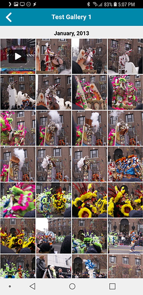

# nowgallery
A simple web-app gallery for desktops, iOS, and Android.

This gallery takes a set of supplied source images and videos in any folder structure you already have and generates small thumbnails, medium sized web images, and HTML5 ready mp4 videos for display in a Progressive Web App.

<table border=0 padding=1>
   <tr>
     <td></td>
     <td></td>
     <td></td>
     <td></td>
  </tr>
</table>

## Install
The best way to install is to use Docker.
```
docker pull nowsci/nowgallery
```
With the following docker compose:
```
  nowgallery:
    image: nowsci/nowgallery
    container_name: nowgallery
    ports:
      - 80:80
    volumes:
      - ./nowgallery/images:/webimages
      - ./nowgallery/nowgallery.conf:/etc/nowgallery.conf:ro
      - /storage/Pictures:/sourceimages:ro
    restart: always
```
This would store any rendered thumbnails and medium sized images into `./nowgallery/images` based on existing source images in `/storage/Pictures`.

After you start the container, you can go back and edit `./nowgallery/nowgallery.conf` to change settings, though this should not be needed.

## Manual install
If you wish to manually install on a system like Ubuntu, you can use the following commands on a system that has Apache and PHP installed. If you wish to use paths other than `/webimages` and `/sourceimages` you can edit `/etc/nowgallery.conf`.
```
apt-get update
apt-get install -y ffmpeg git libmagickwand-dev --no-install-recommends
pecl install imagick && docker-php-ext-enable imagick
cd /tmp
git clone https://github.com/Fmstrat/nowgallery.git
cd nowgallery
cp -a html/* /var/www/html/*
mkdir /webimages
ln -s /path/to/your/source/images /sourceimages
cp config/nowgallery.conf /etc/nowgallery.conf
mkdir /scripts
cp -a scripts/* /scriptes/
```

## Scanning images
This will create thumbnails and mid-sized images. Run once the container is active.
```
docker exec nowgallery php /scripts/scan.php
```
or
```
php /scripts/scan.php
```

## Setting username/password for Web-app
Run once the container is active.
```
docker exec -ti nowgallery php /scripts/user.php
```
or
```
php /scripts/user.php
```
